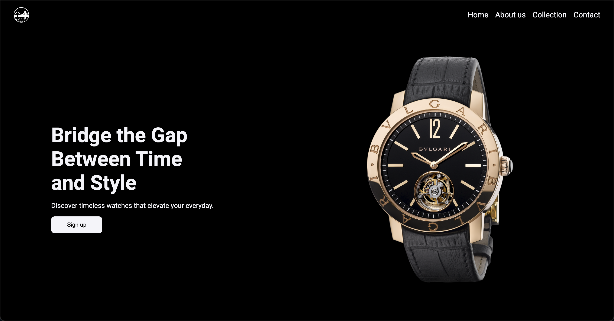

**Bridge Landing Page** 



**Description**

This landing page was created for educational purposes within the Odin Project curriculum. It serves as a practical exercise to build a simple web page using Flexbox and hone CSS skills.

**Features**

* **Flexbox Layout:** Utilizes Flexbox properties to structure the page's content in a responsive and adaptable manner.
* **CSS Practice:** Provides a platform to experiment with various CSS techniques and styling.

**Getting Started**

1. **Clone the Repository:**
   ```bash
   git clone https://github.com/your-username/landing-page.git
   ```
   (Replace `https://github.com/your-username/landing-page.git` with the actual URL of your repository)

2. **Open the Files:**
   - Use a code editor or IDE of your choice to open the project directory.
   - The main HTML file for the landing page is typically named `index.html`.

3. **View the Page:**
   - Open `index.html` in your web browser to see the landing page in action.

**Contributing** (Optional - Include if you want others to contribute)

Feel free to fork this repository and make your own modifications. If you'd like to contribute your changes back to the main project, please consider creating a pull request.

**Image Integration**
Resource 1: https://www.pngwing.com/
Resource 2: https://unsplash.com/


**Enjoy**
